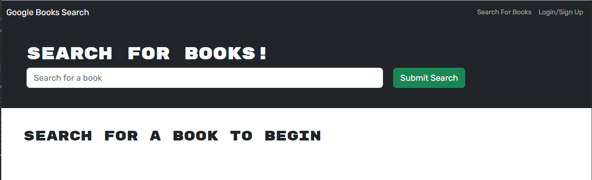

# Book-Search-Engine-MERN

## Description

Book Search Engine is a project that was used to practice replacing a RESTful API with GraphQL, using the MERN stack. Users can search for books, save books for later viewing, and remove books from their previously saved choices when desired.

## Table of Contents

- [Installation](#installation)
- [Usage](#usage)

## Installation

If you would like to clone and use this repo, you will need to install MongoDB and will likely want to install MongoDB Compass to view the database.

Instructions for installing MongoDB and MongoDB Compass can be found here:

MongoDB: https://www.mongodb.com/docs/manual/installation/

Compass: https://www.mongodb.com/docs/compass/current/install/

## Usage

You can click the Login/Sign Up link in the upper-right corner of the navbar and choose the sign up option to create an account, or login, if an account has already been created. You can search for books without signing up, or logging in, however once you are signed in, books can be saved for later viewing by clicking the "Save this Book!" button at the bottom of the book's description. You can view your list of books by clicking the "See Your Books" link next to the "Search For Books" link and remove books by clicking the "Remove this Book!" button at the bottom of the book's description.

In order to view the application, click the link below.

